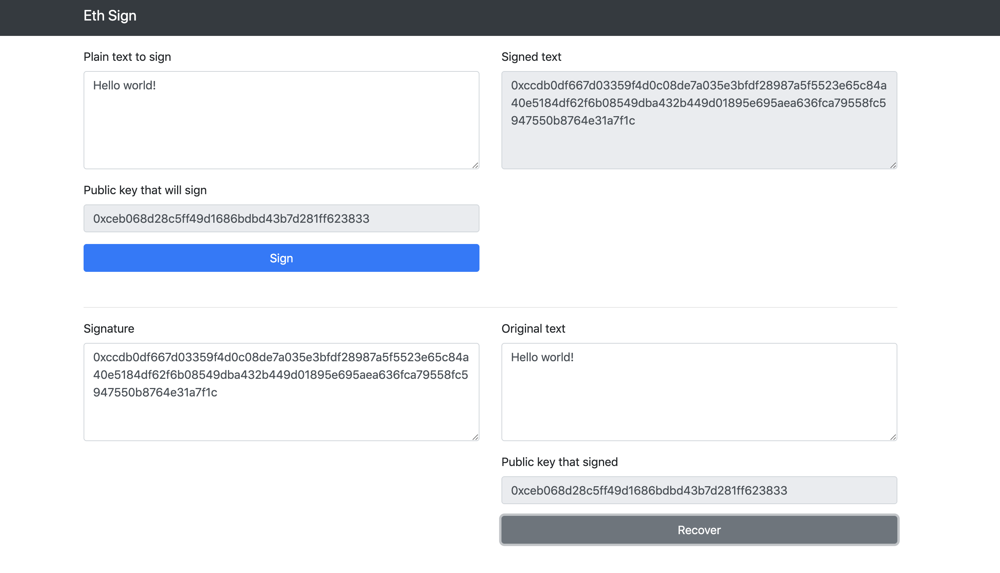

# Ethereum sign and recover example

## [Live demo HERE](https://ernestognw.github.io/ethereum_signature/dist/index.html)

Web3 has its eth.personal.sign function that allows developers to use users private keys to sign messages to prove identity with its reverse function that finds the public key that signed the message.

Requires metamask or some injected Web3 Provider.

## How does it works?

Node.JS > 10 required

* `npm install` to install dependecies
* `npm run start` to run webpack dev server with hot reloading
* Go to `localhost:9000` and start testing
* Accept the connection request from metamask
* Write some data to sign
* Click sign button
* This process will return a signature, that can be reversed by web3.eth.personal.ecRecover process
* Copy signature
* Paste on signature textbox
* Copy original message signed in original message textbox
* Click on recover and see the magic

Please try to change parameters on the original message and signature to check how the results vary respect to the original signer aaccount

## Licensed

MIT